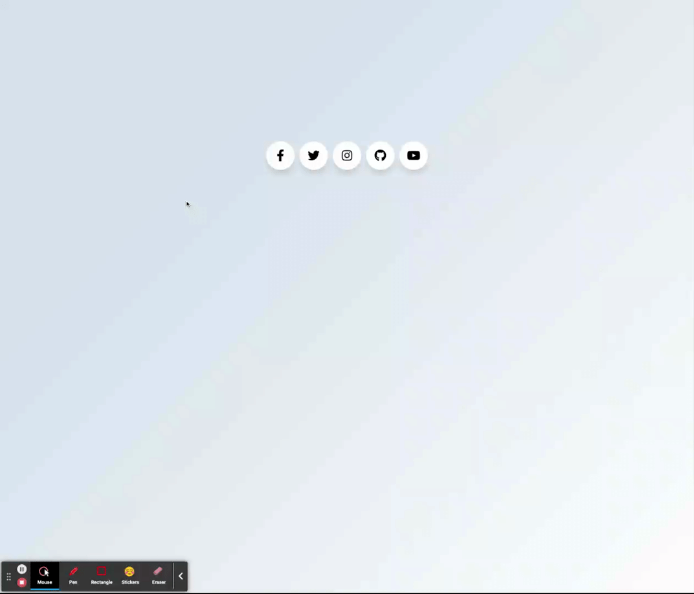

# social-buttons

## Description

Social Buttons that can be linked to social media accounts. Animation with hover. For display purposes only.

## Table of Contents

- [Demo](#Demo)
- [License](#license)
- [Questions](#questions)

## Demo

[Demo Here](https://fast-slope.surge22.sh/)

## License

This project is licensed under the MIT license.

## Questions

If you have any questions about the repo, open an issue or contact [siryaw](https://api.github.com/users/siryaw)
